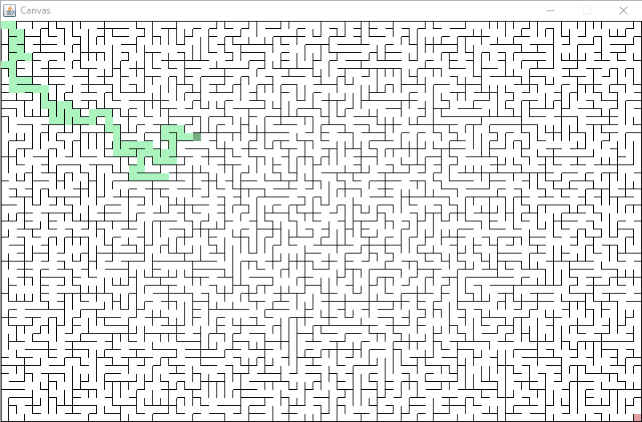

# Mazes

**Course Website**: https://course.ccs.neu.edu/cs2510/

## Introduction
This is a maze game where players must try to escape by navigating their way
from the top-left of the maze to the bottom-right. Each maze is different, and
there are mazes of all different sizes.

## How to Play
You are the green square in the top-left corner. The objective is to reach the
pink square in the bottom-right corner. You navigate your player using the arrow
keys. If you want to generate a different maze to play, you can press "R" to
reset the game. If you want to solve the maze using depth-first search (DFS),
press "D". 

As you move, your path will be highlighted in light green.

Similarly, if you choose to have the maze solved for you, the path of the search
will be highlighted in light blue.

## How to Change Map Dimensions
The maze can be resized by changing the `MAZE_HEIGHT` and `MAZE_WIDTH` variables
in the `Maze` class.

*Example 10x20 Maze*

*Example 50x80 Maze*

*Example 100x100 Maze*

## Classes/Methods
The player class has two fields: `Vertex position`, which keeps track of the
player’s position according to the `Vertex` that s/he is on, and `IList<Vertex>
visited`, which is updated in the `Maze` class with the player’s previous
position each time the player moves (so that the path can be highlighted along
the way).

The `Vertex` class has four `Edge` fields, which correspond to the four out
edges from this `Vertex`, and an `ArrayList<Vertex> adj` field, which holds the
four vertices surrounding this `Vertex`. Since each `Vertex` only needs to
render a right edge and a down edge to form a complete grid, each `Vertex` also
has two `boolean` fields, which correspond to these two edges and are `true` if
that edge should be rendered. The `int x` and `int y` fields keep track of this
`Vertex`’s position on the board in logical coordinates, with the origin at the
top-left corner of the screen. Lastly, the `boolean isVisited` field is used
when creating the `hashmap` for the DFS.

The `Edge` class contains a `Vertex from`, a `Vertex to`, and an `int weight`.

In the `Maze` class, each `Vertex` is first initialized with a position
(`initVertices()`). Next, the right and down edges for each `Vertex` is
initialized (`initVertEdges()`), and the `ArrayList<Edge>` returned is set as
the worklist. `randomWeights()` randomizes the weights of the edges in the
worklist for `unionFind()`. After performing `unionFind()`, `fixVertEdges()`
fixes the `boolean`s of each `Vertex` to indicate which edges should be drawn.
`fixVertAdj()` sets the neighboring vertices of each `Vertex` for DFS to run
properly. `search()` performs the search, and it takes in either a `Stack` or a
`Queue`, depending on the search (which is set in `onKey()`). `fixPlayer()`
fixes the edges of the player's current `Vertex` so that the player cannot walk
through walls.

